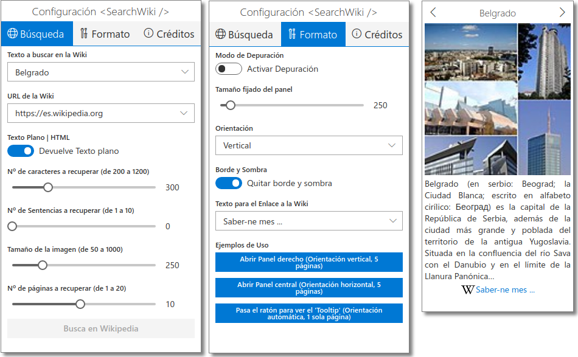

# SearchWiki Example

[](https://github.com/lmoreso/search-wiki)
[](https://github.com/lmoreso/search-wiki/issues)
[](https://github.com/lmoreso/search-wiki/pulls)
[](/LICENSE)

---

SearchWiki es un componente React realizado con FluentUI, y, por tanto, escrito en Typescript, que es capaz de lanzar una consulta a cualquier Wiki (como Wikipedia), extraer un extracto del artículo(s) encontrado(s) (primeras frases y foto principal) y mostrarlos en el navegador.

## Table of Contents

- [About](#about)
- [Getting Started](#getting-started)
- [Usage](#usage)
- [Built Using](#built-using)
- [Authors](#authors)
- [Acknowledgments](#acknowledgements)

## About

SearchWiki es un componente React realizado con FluentUI, y, por tanto, escrito en Typescript, que es capaz de lanzar una consulta a cualquier Wiki (como Wikipedia), extraer un extracto (primeros párrafos y foto principal) del artículo(s) encontrado(s) y mostrarlos en el navegador.

- Puede utilizarse en Tooltips, en los Paneles Modales y laterales de FluentUI, y donde se te ocurra.
- Esta aplicación muestra ejemplos de uso y configuración del componente.
- [Pincha aquí para probar la aplicación.](https://lmoreso.neocities.org/search-wiki-example/index.html)

## Getting Started

Esta aplicación ha sido creada con create-react-app, con lo cual es muy facil de utilizar:

- Clona la aplicación en una carpeta de tu PC (por ejemplo, 'search-wiki-example').
- Ves a la carpeta principal e instala las dependencias:

```bash
search-wiki-example$ npm install
```

- Lanza el server:

```bash
search-wiki-example$ npm run start
```

- Si no se abre un navegador de forma automática, ábrelo y ves a la dirección indicada por el servidor.

```bash
Compiled successfully!

You can now view search-wiki in the browser.

  Local:            http://localhost:3000/
  On Your Network:  http://192.168.1.106:3000/
  ```

## Usage

La aplicación consta de 2 paneles:

1. El panel izquierdo, para configurar el componente, se divide en dos pestañas:

- Búsqueda, para configurar los parámetros de la llamada a la API de MediaWiki.
- Formato, para configurar la presentación de los resultados.
<!-- markdownlint-disable MD029 -->
2. El panel derecho, donde se muestran los resultados.



### Configuración de la Búsqueda

Cuando cambies cualquier parámetro, se activará el botón 'Busca en Wikipedia', el cual lanza la query y pinta los resultados en el panel derecho, según el formato establecido en la pestaña 'Formato'.

### Configuración del Formato de presentación

El cambio de cualquier parámetro se refleja directamente en el resultado.

### Resultado

El resultado consta de 4 elementos:

- Título: es el título de la página encontrada, no el texto de búsqueda. Si has pedido mas de una página aparecen unas flechas para navegar entre cada una de ellas.
- Fotografía: es la foto devuelta por la API.
- Extracto: es el texto devuelto por la API.
- Enlace a la página de Wikipedia. Sólo se pinta si se ha suministrado un texto para el enlace.

## Built Using

- [NodeJs](https://nodejs.org/en/) - Server Environment
- [ReactJs](https://reactjs.org/) - Web Framework
- [FluentUI](https://developer.microsoft.com/en-us/fluentui#/controls/web/) - UI Framework
- [Typescript](https://www.typescriptlang.org/docs/)

## Authors

- [@lmoreso](https://github.com/lmoreso) - Idea & Initial work

<!-- See also the list of [contributors](https://github.com/lmoreso/search-wiki/contributors) who participated in this project. -->

## Acknowledgements

- [Mediawiki](https://www.mediawiki.org/wiki/MediaWiki) - Por publicar los servicios REST.
- [Wikipedia](https://wikimediafoundation.org/) - Por la gestión de los contenidos.

[Table of Contents](#table-of-contents)
